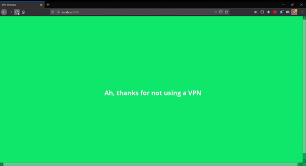

# Simple VPN detection ([Demo](https://simple-vpn-detector.netlify.com/))

I found it fascinating that services like Netflix could detect that you're using a VPN to get around geo-restrictions on content. I wanted to explore an idea for how to implement a similar detection service.

## The Idea

Even though you're effectively changing the IP address the remote server sees when you use a VPN, client side Javascript still runs on your browser, which has time settings set by the operating system.

By comparing the timezone of the browser with that of the IP address reported, we can pretty easily tell if someone is using a VPN to get around a geo-restriction (and tell quite a bit about the location of the user too)

### How to test
* clone this repository
* Run `index.html` (I use `http-server` from NPM to serve a static server)
* Refresh the page after turning on your VPN

## Solution

Remember to change your computer timezone to match your VPN 😉